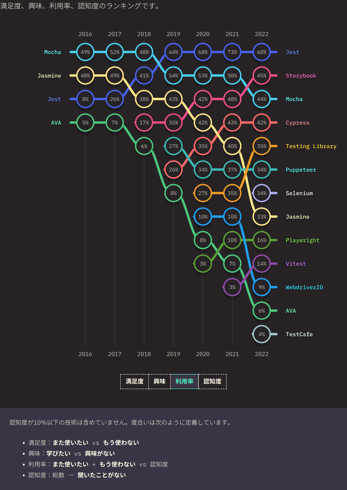

# Jestとは

Jest公式サイト: [https://jestjs.io/ja](https://jestjs.io/ja)

Jestは、JavaScriptのテストを行うためのフレームワークです。
2022年現在、JavaScriptを使用する多くの開発者が使用している人気のツールです。

> 
>
> ―― 画像の出典: [2022.stateofjs.com](https://2022.stateofjs.com/ja-JP/libraries/testing/)
