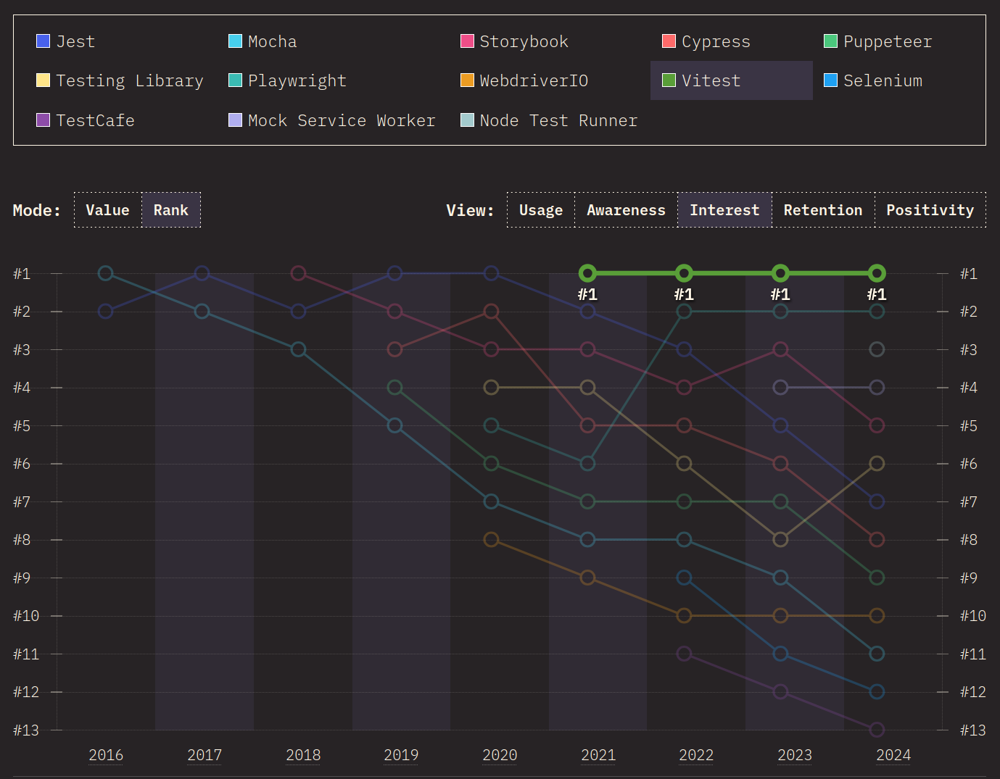

# Vitestとは

Vitest公式サイト: <https://vitest.dev/>

VitestはJavaScriptのテストを行うためのフレームワークです。
2024年現在、JavaScriptを使用する開発者の中で最も関心を集めているテストツールです。

> \
> ―― 画像の出典: [2024.stateofjs.com](https://2024.stateofjs.com/ja-JP/libraries/testing/)
